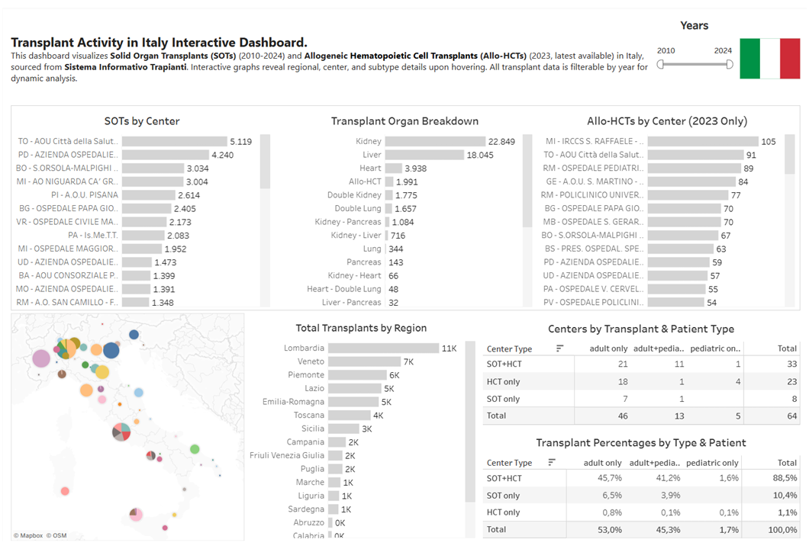

# Italy Transplant Atlas – Data Pipeline Project

This project builds a unified dataset on **Solid Organ Transplants (SOTs)** in Italy from **2010 to 2024** and **Allogeneic Hematopoietic Cell Transplants (Allo-HCTs)** in Italy in 2023 only . The aim is to support transparent, reproducible, and accessible **data visualization** for public insight, policy discussions, and academic research.

---

## 📌 Project Overview

The project follows a full data pipeline, from raw data scraping to visualization-ready output.

---

### 1. 🔍 Data Collection (Scraping)

- **HCT data** was extracted from 2023 annual [**PDF report**](https://www.trapianti.salute.gov.it/imgs/C_17_cntPubblicazioni_636_allegato.pdf) published by the *Centro Nazionale Trapianti (CNT)*.
- **SOT data** was scraped from the [**Sistema Informativo Trapianti (SIT)**](https://trapianti.sanita.it/statistiche/trapianti_per_anno.aspx) dynamic web portal using automated scripts.

**Jupyter notebooks:**
- 🧾 **2 notebooks** for HCT scraping:
  - Parsing and structuring semi-structured PDF tables.

- 🌐 **5 notebooks** for SOT scraping:
  - HTML structure inspection.
  - Scraping strategy and reusable tools (`utils.py`).
  - Iterative data extraction for all organs and centers, 2010–2024.

---

### 2. 🧼 Data Cleaning & Normalization

- Standardization of center names across datasets.
- Deduplication and harmonization of naming variants (e.g., removing suffixes, resolving aliases).
- Introduction of a `Type` field:
  - `"SOT only"` – center performs only organ transplants.
  - `"HCT only"` – center performs only allogeneic hematopoietic cell transplants.
  - `"SOT+HCT"` – center performs both.

---

### 3. 🔄 Data Integration

The cleaned datasets were transformed into a common structure:

```text
region | city | center_name | center_type | patient | organ | subtype | number | year
```
Both datasets were merged into a **single file** for downstream visualization and analysis.

---

### 4. 💾 Output for Visualization
The unified dataset was exported in multiple formats:

- `transplants_italy_clean.csv` – for integration with BI tools.

- `transplants_italy_clean.xlsx` – for inspection and manual analysis.

Compatible with:

📊 Tableau Public

📈 Power BI

🌍 Google Looker Studio

---

### 🚀 Data Visualization

Use this dataset to build interactive dashboards, conduct regional analyses, and explore trends over time across transplant types and centers.

🔍 **Want to see it in action?**  
Explore the live dashboard: [Italy Transplant Atlas](https://public.tableau.com/views/Transplant_Activity_Italy_2010-2024_V2/Transplants_Italy?:language=it-IT&:sid=&:redirect=auth&:display_count=n&:origin=viz_share_link)

---

### 🛠 Technologies Used
- Python (numpy, pandas, camelot, selenium, os, time)

- Jupyter Notebooks

- Tableau Public / Power BI

- GitHub

---

### 📁 Repository Structure

```text
├── bi_dashboards/                    # Tableau and Power BI packaged workbooks
├── data_raw/                         # Scraped data (per year) in CSV format
├── data_cleaned/                     # Cleaned and harmonized datasets (CSV/XLSX)
├── data_final_for_dataviz/           # Final export files ready for data visualization
├── images/                           # Reference images used in notebooks (e.g., HTML inspection)
├── notebooks/
│   ├── 01_Extract_Tables_from_PDF/          # Parse HCT tables from official CNT PDF
│   ├── 02_Create_HCT_DataFrame/             # Build structured HCT dataset
│   ├── 03_Inspect_SOT_Website_Source/       # Explore and analyze HTML structure of SOT portal
│   ├── 04_Scraping_Strategy/                # Define scraping approach and endpoints
│   ├── 05_Test_utils_file/                  # Prototype and test scraping functions
│   ├── 06_Manipulating_DataFrames_to_build_one_single_DataFrame/   # Merge scraped data into unified format
│   ├── 07_Scraping_Transplant_Data_for_multiple_years/   # Execute full scraping across years (2010-2024)/organs
│   ├── 08_Load_Clean_and_Reshape_Transplant_Data/  # Clean both SOT and HCT datasets
│   ├── 09_Preparing_Data_for_Data_Visualization/   # Normalize and export final dataset
│   └── utils.py                             # Reusable scraping utilities
```

---

### 🧠 Author
Carlo Signorini
📫 [LinkedIn](https://www.linkedin.com/in/carlosignorini/)

---

### 📜 License
This project is open-source under the MIT License.

---

### 📊 Dashboard Preview

Here's a glimpse of the final dashboard built with the dataset:



